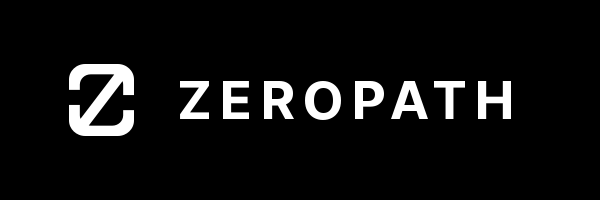

# ZeroPath Security for Visual Studio Code (Alpha)

   
  
   
   
  
  **AI-powered application security platform integration for VS Code**
  
  ⚠️ **ALPHA VERSION - This extension is in early development**
  
  
  
  
  
   

## Overview

> **🚧 Alpha Release Notice**  
> This extension is currently in **alpha** stage. While core features are functional, you may encounter bugs or incomplete functionality. We welcome your feedback and bug reports to help improve the extension.

The ZeroPath Security extension integrates the [ZeroPath](https://zeropath.com) AI-powered security platform directly into VS Code. View security scans, manage vulnerabilities, and apply AI-generated patches without leaving your development environment.

## Features

### 🔍 **Security Scan Management**
- View and manage security scans from your ZeroPath organization
- Support for both full repository scans (FullScan) and pull request scans (PrScan)
- Real-time scan status indicators (completed ✓, running ⚡, failed ✗)
- Issue counts displayed for each scan

### 🐛 **Issue Tracking & Resolution**
- Browse security issues detected by ZeroPath's AI engine
- View detailed issue information including:
  - Severity levels and confidence scores
  - Affected files with line numbers
  - CWE classifications and vulnerability categories
  - Generated titles and descriptions
- Filter issues by scan type, status, and search terms
- Issue statuses: Open, Patched, False Positive, Archived, Processing

### 🔧 **AI-Powered Patch Application**
- Apply AI-generated security patches directly to your codebase
- Review git diff patches before applying
- Support for both:
  - Local patch application via `git apply`
  - Opening existing pull requests for collaborative review
- Request new patches for issues without existing fixes

### 📊 **Integrated Sidebar**
- Dedicated ZeroPath activity bar icon with webview sidebar
- Interactive scan and issue management interface
- Features:
  - Scan type filtering (Full/PR/Both)
  - Issue search functionality
  - Visual status indicators
  - One-click patch application
- Quick access to all ZeroPath features without leaving VS Code

## Installation

> **⚠️ Alpha Version Warning**  
> This is an alpha release intended for early adopters and testing. Features may change, and stability is not guaranteed.

1. Open VS Code
2. Go to Extensions (Ctrl+Shift+X / Cmd+Shift+X)
3. Search for "ZeroPath Security"
4. Click Install
5. Click the ZeroPath icon in the Activity Bar to get started

## Getting Started

### Requirements
- VS Code version 1.74.0 or higher
- A ZeroPath account with API credentials (get them at [zeropath.com](https://zeropath.com))
- Your project must be a Git repository with a remote origin configured

### Quick Setup

1. **Open the ZeroPath sidebar:**
   - Click the ZeroPath icon in the Activity Bar (left side of VS Code)
   - The welcome screen will guide you through setup

2. **Configure your API credentials:**
   - Sign in to your [ZeroPath account](https://zeropath.com)
   - Navigate to Settings → API Tokens
   - Create a new API token if you don't have one
   - Click "Configure Credentials" in the VS Code sidebar
   - Enter your Client ID and Client Secret
   - Select your version control system (GitHub, GitLab, Bitbucket, or Generic)

3. **Start using ZeroPath:**
   - Click "View Scans & Issues" to see your security scans
   - Browse through Full Scans and PR Scans
   - Click on any scan to view its security issues
   - Apply AI-generated patches with one click

## Features in Detail

### 🎨 Integrated Sidebar UI
- **All-in-one webview interface** - Everything is managed through the interactive sidebar
- **Visual scan browser** - See all your repository's security scans with status indicators
- **Issue management** - Browse, search, and filter security issues:
  - View by severity (Critical, High, Medium, Low)
  - Filter by status (Open, Patched, False Positive, etc.)
  - Search by title or description
- **One-click fixes** - Apply AI-generated patches or open PRs directly from the UI

### 🔐 Secure Setup
- API credentials stored securely in VS Code's Secret Storage
- Guided setup flow with credential validation
- Automatic organization detection via API token
- Repository detection from Git remote URL
- Support for multiple VCS providers:
  - GitHub
  - GitLab  
  - Bitbucket
  - Generic Git repositories
- Configurable API base URL for enterprise deployments

### 🔍 Security Intelligence
- View issues from ZeroPath's AI-powered security analysis
- Access detailed vulnerability descriptions and remediation guidance
- Apply validated security patches with confidence
- Track issue status: Open, Patched, False Positive, or Archived

## Available Commands

The extension provides the following commands (accessible via Command Palette - Ctrl/Cmd+Shift+P):

- `ZeroPath: Configure` - Set up your API credentials
- `ZeroPath: Configure ZeroPath Credentials` - Update API tokens
- `ZeroPath: List ZeroPath Scans (Current Repo)` - Browse all scans via command palette
- `ZeroPath: Show ZeroPath Issues (Active)` - View issues for the current repository
- `ZeroPath: Apply ZeroPath Patch for Issue` - Apply a specific patch
- `ZeroPath: View Scans` - Open the scan view in the sidebar

## How It Works

### 1️⃣ Connect Your Repository
The extension automatically detects your Git repository and connects it to your ZeroPath organization.

### 2️⃣ View Security Data
- Browse all security scans performed on your repository
- View both full repository scans and pull request scans
- See AI-detected vulnerabilities with detailed explanations

### 3️⃣ Apply Fixes
- Review AI-generated security patches before applying
- Apply patches locally with a single click
- Open existing pull requests for collaborative review

### 4️⃣ Track Progress
- Monitor issue resolution status
- See which vulnerabilities have been patched
- Mark false positives to reduce noise

## Troubleshooting

### Common Issues

**"No workspace folder found"**
- Ensure you have a folder open in VS Code
- The folder must be a Git repository with initialized `.git` directory

**"Could not determine git remote URL"**
- Verify your repository has a remote origin configured
- Run `git remote -v` to check your remotes

**"ZeroPath organization not found"**
- Check your API credentials are correct
- Ensure your token has access to at least one organization
- The extension auto-detects the organization from your API token
- You can manually set `zeropath.organizationId` in settings if needed

**"Failed to apply patch"**
- Ensure you have no uncommitted changes
- The patch may conflict with local modifications
- Try pulling the latest changes first

## Support & Feedback

**Your feedback is crucial during this alpha phase!** Please report any issues or suggestions.

- **Report Issues:** [GitHub Issues](https://github.com/ZeroPathAI/zeropath-vscode-plugin/issues)
- **Alpha Feedback:** Please tag issues with `[ALPHA]` for priority review
- **Documentation:** [ZeroPath Docs](https://docs.zeropath.com)
- **Email Support:** support@zeropath.com
- **Website:** [zeropath.com](https://zeropath.com)

## Configuration Options

The extension can be configured through VS Code settings:

- `zeropath.vcs` - Primary VCS provider (github/gitlab/bitbucket/generic)
- `zeropath.apiBaseUrl` - API base URL (default: https://zeropath.com)
- `zeropath.organizationId` - Organization ID (auto-detected from token)
- `zeropath.defaultScanType` - Default scan type filter (FullScan/PrScan)

## Privacy & Security

- API credentials are stored securely in VS Code's Secret Storage
- No source code is sent to ZeroPath servers unless explicitly scanned
- All communication uses HTTPS encryption
- See our [Privacy Policy](https://zeropath.com/privacy) for details

## Contributing

We welcome contributions! Please visit our [GitHub repository](https://github.com/ZeroPathAI/zeropath-vscode-plugin) for more information.

## Alpha Limitations

As an alpha release, please be aware of the following:

- **Stability:** The extension may crash or behave unexpectedly
- **Features:** Some features may be incomplete or subject to change
- **Performance:** Performance optimizations are ongoing
- **Compatibility:** May not work with all VS Code configurations
- **Data:** Do not use for production-critical security assessments

## Roadmap

### Alpha to Beta Milestones
- Improved error handling and stability
- Performance optimizations for large repositories
- Enhanced UI/UX based on user feedback
- Comprehensive testing coverage
- Documentation improvements

### Upcoming Features

- **On-demand scanning** - Trigger new security scans directly from VS Code
- **Inline annotations** - View security issues as code annotations
- **Real-time updates** - Live scan progress and issue updates
- **Dashboard view** - Comprehensive security metrics and trends

## License

This extension is licensed under the [MIT License](LICENSE).

## Changelog

### Version 0.0.1-alpha
- Initial alpha release
- Interactive sidebar interface for managing security scans (alpha)
- View and browse Full Scans and PR Scans (alpha)
- Search and filter security issues by severity and status (alpha)
- Apply AI-generated security patches (alpha)
- Pull request integration for collaborative fixes (alpha)
- Secure credential storage
- Support for GitHub, GitLab, Bitbucket, and generic Git repositories

---

  <strong>Built with ❤️ by the ZeroPath Team</strong>
  
  [Website](https://zeropath.com) • [Documentation](https://docs.zeropath.com) • [Support](mailto:support@zeropath.com)

